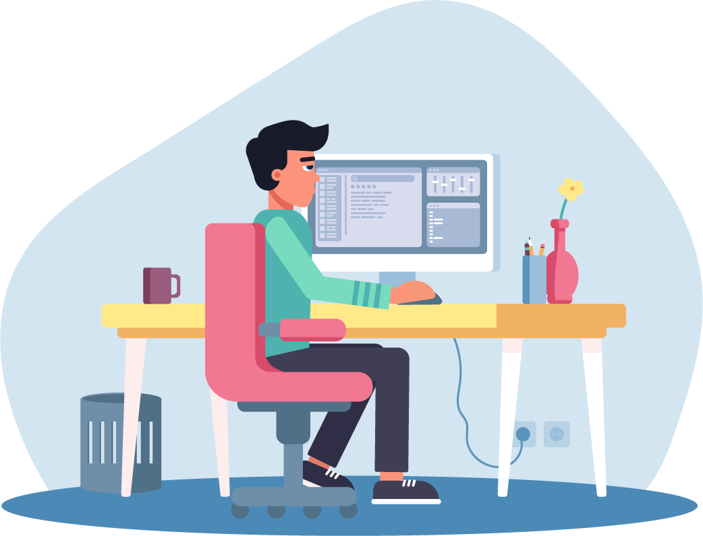

      
    

            
        
        
            
        
        
            
        
        
            
        
    

<h1 align="center">Hi 👋, I'm Muhammad Zeeshan
    <h3 align="center">Full Stack Web Developer 👨‍💻</h3>
</h1>

&nbsp; I am a tech enthusiast and a Web Developer. I am passionate about technology and I love to learn new things.
  
🔎 <strong>I am currently looking for oppurtunities or to collaborate on projects.</strong>
# 🛠️ TechStack and Tools
&nbsp; My learning journey comprises of the following:
<h2>Core Skills</h2>
- HTML5, CSS  
- Php / Laravel  
- Javascript, JQuery  
- Bootstrap, TailwindCss  
- nodejs, Express, npm  
- Git, GitHub  
- MySQL, Postgres   

<h2>Other Skills</h2>

    
 

